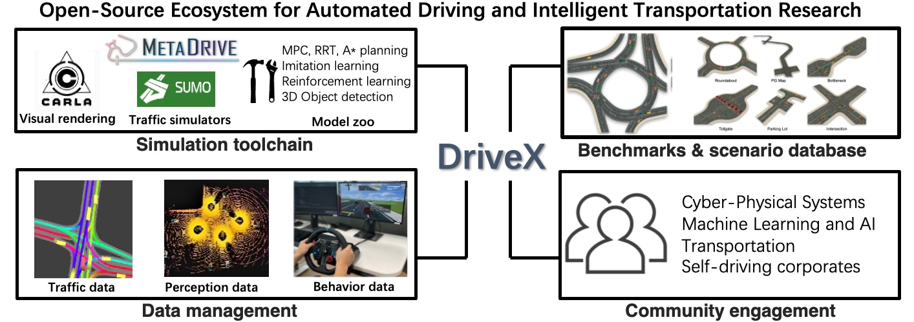

DriveX is an open-source echosystem for automated driving and intelligent transportation system. Its key features can be summarized as:

- **Ecosystem**: DriveX aims at building an ecosystem where researchers and developers from both academia and industry and from different research communities can share data, algorithms, models, and simulation tools.
- **Integrated research pipeline**: DriveX provides an integrated research pipeline that facilitates the research needs of different stakeholders in automated driving and intelligent transportation.
- **Modular design**: DriveX follows a modular design, which not only includes the full-stack automated driving modules from perception, localization, planning, and control, to V2X communication, but also incorporates the capability of the scenario importing and generation for more scalable and generalizable real-world research.
- **Benchmarks and model zoo**: DriveX constructs several benchmarks based on real-world data and evaluates developed algorithms for different tasks of automated driving and intelligent transportation. A model zoo is maintained with the well-polished implementation of typical algorithms and models for each task. Public benchmark and model zoo will accelerate the development of new algorithms and measure the research progress in a transparent way.

